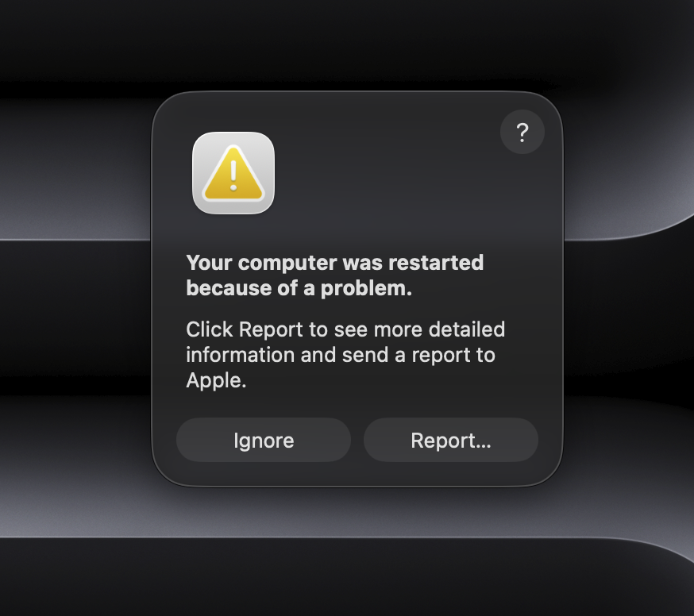
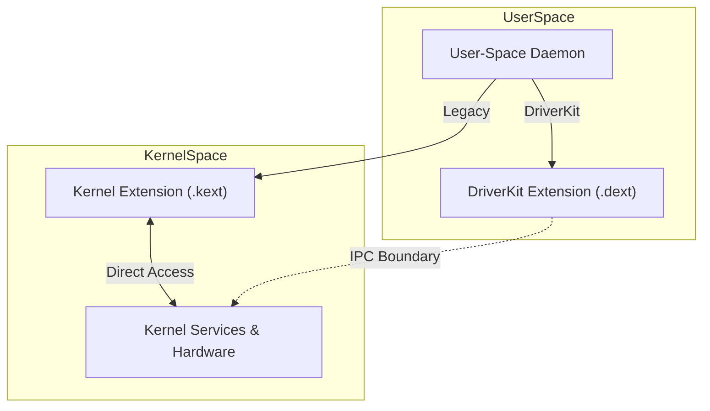
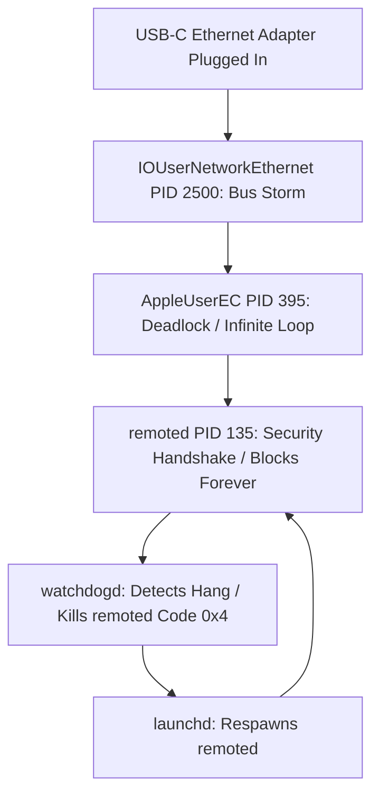

## When a USB-C Adapter Crashes Your Mac: A DriverKit Forensic Investigation

Connecting a USB-C Ethernet adapter triggers a watchdog crash loop in the remote management daemon. This behavior occurs on the MacBookPro16,2 platform running macOS 26.3.1. The system terminates the remoted process upon connection. Log analysis indicates the process exits with code 0x4, signifying a watchdog timeout. This investigation examines the interaction between remoted, DriverKit, and the Embedded Controller leading to this deadlock state.

### Repository Structure

This repository contains the technical investigation and associated resources. The README.md details the forensic breakdown of the deadlock. The diagrams directory stores visualizations of the crash cascade and architecture. The images folder contains diagnostic logs. The scripts directory houses the remediation and cleanup scripts provided to help users recover systems.

### The Promise of DriverKit: Safer Drivers, In Theory

Apple transitioned from kernel extensions (kexts) to DriverKit to move driver execution from kernel space to user space. This architectural shift isolates drivers to prevent a driver failure from causing a kernel panic. IOUserNetworkEthernet is a DriverKit framework used for developing Ethernet device drivers in user space. Wang et al. (2023) note this sandboxed environment provides security and reliability benefits. In this instance, the deadlock involving remoted and the Embedded Controller shows that interactions with system-level services bypass these protections, leading to a system-wide impact.



### Forensic Breakdown



#### 1. The Bus Storm
The connection of the USB-C Ethernet adapter initiates a high-frequency interrupt storm within the IOUserNetworkEthernet framework. This flood of interrupts saturates the communication bus between the user-space driver and the kernel-space infrastructure, causing extreme CPU contention and resource exhaustion.

#### 2. The Embedded Controller Deadlocks
The AppleUserEC driver manages communication with the Embedded Controller (EC). It becomes trapped in an infinite loop while attempting to service the high-frequency interrupts. This state deadlocks the EC subsystem. The subsystem cannot exit the processing loop to handle other critical system tasks (Lastanao Miró, 2025).

#### 3. The Security Handshake Blocked
The remoted process (PID [X]) attempts to perform a standard security handshake requiring hardware-backed cryptographic verification. This operation depends on a response from the Embedded Controller. The deadlocked EC causes remoted to remain blocked indefinitely on a mach_msg call, waiting for a synchronization primitive.

#### 4. The Watchdog Kills the Wrong Process
The watchdogd daemon monitors system responsiveness. It terminates the remoted process after detecting unresponsiveness for 60 seconds. The system logs record exit code 0x4 (Watchdog Timeout). Stackshot evidence confirms remoted suspended in a wait state related to the EC communication channel at the time of termination (Lee, 2005).

#### 5. The Doom Loop
launchd detects the exit upon the termination of remoted and attempts to restore the service by respawning the process. The new instance of remoted immediately attempts the same security handshake. It hits the deadlocked EC again. This creates a continuous cycle of execution, blockage, and termination, consuming system resources and preventing remote management functionality.

### Why Developer Build 26 on Intel

The manifestation of this watchdog deadlock in developer build 26 on Intel-based Mac hardware highlights architectural challenges. macOS development prioritizes Apple Silicon. The DriverKit implementation on Intel remains susceptible to regressions. DriverKit targets the tighter hardware-software integration of Apple chips. Intel platforms require additional abstraction layers to interface with legacy components like the Intel-based Embedded Controller. These layers introduce latency and synchronization issues. Developer seeds undergo less rigorous testing on older hardware configurations. This allows platform-specific edge cases, such as the interrupt handling failure observed here, to persist. The focus on optimizing for unified memory and ARM-based interrupt controllers creates unforeseen bottlenecks when applied to decoupled architectures.

### When Guard Dogs Turn: The Watchdog Failure Mode

The watchdogd daemon functions as a primary mechanism for maintaining system availability by monitoring the liveness of critical processes. It expects specific heartbeats or responses to Mach messages within predefined intervals. watchdogd correctly identifies a failure in the daemon when remoted stops responding due to the Embedded Controller deadlock. It incorrectly identifies remoted as the root cause. Terminating remoted with exit code 0x4 treats a symptomatic blockage as a process-level hang.

This recovery strategy fails. The state of the hardware abstraction layer, specifically the AppleUserEC driver, remains corrupted. A design improvement for macOS service management requires an escalation policy. The system must investigate the common dependency causing the hang after a threshold of repeated watchdog-induced respawns for a single process. Detecting multiple remoted instances failing at the same synchronization point should trigger a reset of the Embedded Controller interface or a forced reload of the associated DriverKit extension to break the loop.

### Engineering Takeaways

- User-space isolation does not guarantee system stability. DriverKit prevents kernel panics, but a malfunctioning user-space driver triggers deadlocks in critical system services through shared resources or synchronization primitives.
- Cross-subsystem dependencies require careful mapping and mitigation. The dependency of a security daemon like remoted on hardware controllers creates a single point of failure where a peripheral issue disables core system management.
- Intelligent watchdog escalation ensures effective fault recovery. Simple process termination and restart cycles fail when the underlying cause involves persistent state corruption in a dependency. A holistic diagnostic approach is necessary.
- Continuous testing on legacy hardware remains vital during platform transitions. Regressions in abstraction layers on older architectures remain hidden if development and automated testing primarily target current-generation silicon.

### Immediate Workarounds

- Unplug the USB-C Ethernet adapter to break the interrupt loop and allow the Embedded Controller to recover.
- Connect the adapter through a powered USB-C hub to isolate the power and signaling characteristics from direct ports.
- Replace the current adapter with an officially supported brand to ensure compliance with DriverKit timing requirements.
- Disable Remote Management in System Settings to prevent the remoted process from attempting the failing security handshake.

### Kernel Boot Arguments

Setting specific kernel boot arguments assists in diagnosing or bypassing driver-related deadlocks during the boot process. Set these by booting into Single-User Mode (Cmd-S at startup on Intel Macs) or using the nvram command from Terminal.

- wait=yes: Forces the kernel to wait for a debugger connection before proceeding, allowing early-stage driver inspection.
- -iogdebug: Enables verbose logging for I/O Graphics and related frameworks, providing context on Embedded Controller synchronization.
- dart=0: Disables the I/O Memory Management Unit (IOMMU/VT-d), bypassing specific DriverKit mapping failures at the cost of system security.

Incorrect boot arguments render the system unbootable. Ensure a current backup exists and review NVRAM reset procedures (Option-Cmd-P-R) before proceeding.

To clear all custom boot arguments and return to default settings, run:
sudo nvram -d boot-args

### Remediation Script

This script performs a system-level reset of network and remote management configurations to break the watchdog loop. It deletes all saved network configurations and locations. Reconfigure Wi-Fi passwords and Ethernet settings after execution.

```bash
#!/bin/bash

if [ "$EUID" -ne 0 ]; then
  exit 1
fi

/System/Library/CoreServices/RemoteManagement/ARDAgent.app/Contents/Resources/kickstart -deactivate -stop || true

rm -f /Library/Preferences/com.apple.RemoteManagement.plist
rm -f /Library/Preferences/com.apple.RemoteDesktop.plist

rm -f /Library/Preferences/SystemConfiguration/NetworkInterfaces.plist
rm -f /Library/Preferences/SystemConfiguration/preferences.plist

nvram -c || true

systemextensionsctl list | grep "IOUserNetworkEthernet" || true

sleep 5
reboot
```

### How to Report This to Apple

File a report using the Feedback Assistant app or the Apple Developer portal. Provide comprehensive diagnostic data for engineers to resolve the underlying DriverKit and Embedded Controller regressions.

Include the following in your report:
- sysdiagnose output: Run sudo sysdiagnose in Terminal and attach the resulting .tar.gz file. This captures system logs, driver states, and configuration data.
- Stackshot: Capture a stackshot using the Shift-Control-Option-Command-Period shortcut if the system is partially responsive.
- Log excerpts: Provide specific excerpts from the Console app showing watchdogd terminating remoted with exit code 0x4.
- Hardware details: State the Mac model (e.g., MacBookPro16,2) and the specific macOS developer build version.

Referencing this investigation provides additional context on the interaction between remoted, IOUserNetworkEthernet, and AppleUserEC.

### References

- Grapentin, A. (2020). Operating systems II - student projects. Hasso-Plattner-Institut.
- Lastanao Miró, D. (2025). Characterizing tactics, techniques, and procedures in the macOS threat landscape. Computers & Security, 162(2026), 104806.
- Lee, G. (2005). I/O Kit Drivers for L4. Trustworthy Systems.
- Wang, B., Noorafshan, S., Achermann, R., & Seltzer, M. (2023). Synthesizing Device Drivers with Ghost Writer. Proceedings of the 12th Workshop on Programming Languages and Operating Systems, 10-17.
